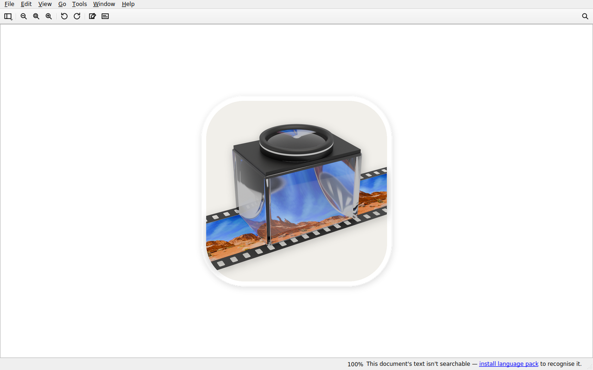

# Wayland smoke CI tier

The `wayland-smoke` job in [`.github/workflows/ci.yml`](../../.github/workflows/ci.yml)
launches the real built `trailer` binary on a headless Wayland compositor and
screenshots it. It is the one CI check that proves Trailer runs natively on
Wayland — something the offscreen unit tier and the Wine tier structurally
cannot prove. Its oracle is deterministic (a hard pass/fail), so it is
*eligible* to gate merges.

**Branch-protection status: keep it NON-REQUIRED (advisory) for now.** The job
runs on every PR and every push to `main`, but until `sway` + `grim` are baked
into the runner image (see *Runner image / ride-along* below) it apt-installs
them per run, pulling a real dependency tree through the egress proxy; a single
proxy hiccup would then red-gate unrelated PRs. Until the bake lands, do **not**
mark it a required check. There is a second reason to hold off: `ci.yml` carries
`paths-ignore: ['**.md', 'docs/**']`, so a docs-only PR skips the whole workflow
— a *required* `wayland-smoke` would hang forever on "Expected" for those PRs
(the same caveat already documented for `build-and-test`). Promote it to
required only after the packages are baked in **and** the paths-ignore
interaction is resolved (a same-name no-op workflow on the inverse paths, or
dropping paths-ignore).

Driver: [`scripts/wayland-smoke.sh`](../../scripts/wayland-smoke.sh).

## What the tier does

1. Creates a **short** `XDG_RUNTIME_DIR` (a fresh `mktemp` dir under `/tmp`).
   sway's IPC socket path must fit `sockaddr_un.sun_path` (~108 chars); a long
   scratchpad path overflows it and sway segfaults at startup.
2. Starts **sway** headless — `WLR_BACKENDS=headless`, `WLR_RENDERER=pixman`
   (no GPU in the k8s pods; the GLES renderer segfaults), a 3-line config
   pinning a `1280x800` `HEADLESS-1` output. Polls for the wayland socket; no
   blind sleep.
3. Launches `build/trailer` on a sample image (`docs/perf/corpus/photo.jpg`)
   under `QT_QPA_PLATFORM=wayland` with `QT_LOGGING_RULES='qt.qpa.*=true'`.
4. **Asserts `platformName == wayland`** by grepping the qt.qpa log for the
   `Successfully loaded Qt platform plugin "wayland"` line, and hard-fails on
   an `xcb`/`offscreen`/`minimal` fallback line. Before launching it also
   **hard-asserts** a Qt plugins dir containing `libqwayland*.so` was resolved
   (from `QT_PLUGIN_PATH` — the CI job exports it from the same Qt the build
   used — or a local auto-detect), so a missing plugin fails clearly instead of
   silently falling back.
5. **Hard-gates that a surface actually maps.** "Plugin loaded" proves the
   plugin bound, not that a window mapped. The script polls `swaymsg get_tree`
   until a view with an `app_id` appears (bounded deadline) and fails if none
   does — catching "plugin loaded but the surface never mapped" before capture.
   (If `swaymsg`/`SWAYSOCK` is unavailable it skips this gate and leans on the
   capture-retry loop as the real oracle.)
6. **Poll-captures with grim until a non-blank `1280x800` frame lands.** Rather
   than a fixed settle + single capture (which flaked on slow runners that had
   not committed the first painted frame when grim fired), it re-captures on a
   throttled interval up to a generous deadline, succeeding as soon as a
   non-blank frame is captured and failing only if the deadline passes. A bare
   sway output is a solid colour (the config pins `bg #000000 solid_color`), so
   a capture stays blank unless Trailer actually paints; painted UI has
   thousands of unique colours. Uses ImageMagick `identify` when present, and
   falls back to a pure-stdlib Python PNG analyzer (zlib IDAT + scanline
   unfilter + unique-colour count; non-interlaced only) so the script is
   self-contained. The final captured PNG is uploaded as a CI artifact. The
   colour-count check fails **closed** on a non-numeric count.

A `trap cleanup EXIT` (with `trap 'exit 130' INT TERM`) kills trailer + sway
and removes the runtime dir exactly once on exit, preserving the real exit
code; each run is idempotent and re-runnable.

## Design decisions

### Why sway, not weston

Both compositors run headless and Qt connects to either. But **weston's
headless backend cannot be screenshotted**: `grim` needs wlroots'
`wlr-screencopy` protocol (weston doesn't expose it), and
`weston-screenshooter` aborts with `Assertion 'width > 0' failed` against the
headless output. sway is wlroots-based, so `grim` works. That is the deciding
factor — the screenshot is the whole deliverable.

### Why launch + screenshot only (no input automation)

Real pointer-driven UI automation is not cleanly available in this CI:
`/dev/uinput` doesn't exist in the k8s pods, so `ydotool` is out; `wtype`
speaks the virtual-keyboard protocol (exits 0) but keystroke *delivery* into a
focused widget was never confirmed. Launch + screenshot + assert is an honest,
useful, deterministic tier on its own; driven input is deferred.

### Why the unit suite and UAT stay on offscreen

They are **deliberately not** run under Wayland here, for reasons that would
otherwise force dishonest bookkeeping (per-test timeouts + label-excludes to
paper over a known hang):

- **Unit suite under Wayland is 57/60, not 60/60.**
  - `test_dirty_marker_zoom` **hangs**: `MainWindow::closeEvent`
    (`src/ui/MainWindow.cpp:4432`) auto-accepts the unsaved-changes modal
    **only** under `offscreen`/`minimal`; under `wayland` it shows the real
    Save/Discard/Cancel dialog and blocks forever with no user. This is the
    systemic blocker.
  - `test_image_scale` fails on fractional-scaling rounding (real-compositor
    DPR vs offscreen `dpr=1`).
  - `test_perf_freehand_repaint` is a wall-time perf budget — noise under a
    compositor (the same `perf` tier the Wine job already drops).
- **UAT can't be pointed at Wayland yet.** `tests/uat/CMakeLists.txt:15` sets
  `QT_QPA_PLATFORM=offscreen` as an *unconditional* per-test `ENVIRONMENT`
  property that overrides an ambient `wayland`, and the same modal hang hits 5
  UAT binaries.

So the unit suite stays on offscreen in `build-and-test` (60/60, ~10s), exactly
mirroring the Wine tier's honest `--label-exclude 'uat|perf'` exclusion, stated
inline rather than hidden.

## Runner image / ride-along

[`docker/runner/Dockerfile`](../../docker/runner/Dockerfile) bakes `sway` +
`grim` alongside the existing X11 tooling. Until that image is rebuilt and the
ARC runner-set repointed at the new tag, the CI job **apt-installs them
per-run** (mirroring the Wine tier's per-run install), so the tier is green
without waiting for an image rebuild — the same ride-along pattern PR #87 used.
That per-run install goes through the egress proxy, so it is wrapped in a
bounded retry (3 attempts with backoff) to ride out a transient proxy hiccup;
even so, this per-run dependency pull is exactly **why the job should stay a
non-required (advisory) check until the bake lands** (see the top of this doc).
The Qt wayland platform plugin needs no package: the aqt Qt 6.11 `linux_gcc_64`
bundle already ships `libqwayland.so` + the xdg-shell integration.

## Proof

`docs/ci/images/wayland-smoke-proof.png` (above) is a genuine capture of Trailer
running on native Wayland (sway + grim) with an image document open — full menu
bar, markup toolbar, and status bar. Not a blank buffer.

## Phase 3 (deferred)

- Fix the offscreen-only modal auto-accept
  (`src/ui/MainWindow.cpp:4432`) so `close()` on a dirty document doesn't hang
  under Wayland, and make `tests/uat/CMakeLists.txt:15`'s forced offscreen a
  default a `-DTRAILER_UAT_PLATFORM=wayland` opt-in can override — the two
  prerequisites for a UAT-on-Wayland tier.
- Stand up the XDG screenshot portal path (dbus + pipewire +
  `xdg-desktop-portal-wlr` + a `portals.conf` mapping) to close the deferred
  backlog item
  [`docs/backlog/2026-07-12-wayland-screenshot-portal.md`](../backlog/2026-07-12-wayland-screenshot-portal.md)
  (screenshot picker must go through the portal or be disabled-with-tooltip,
  never a silent null).
